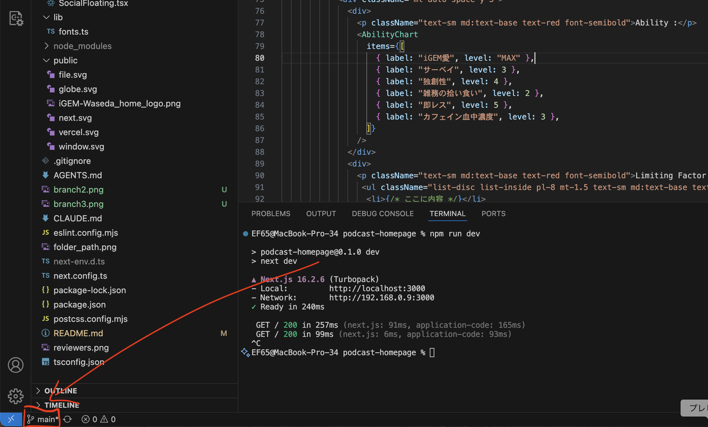
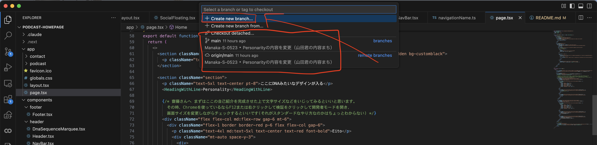
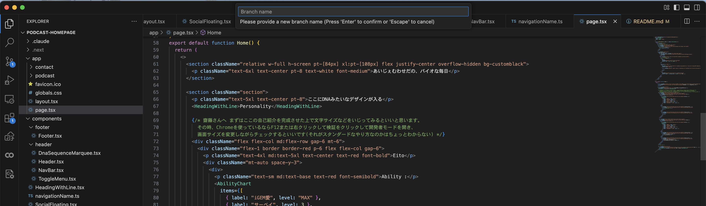
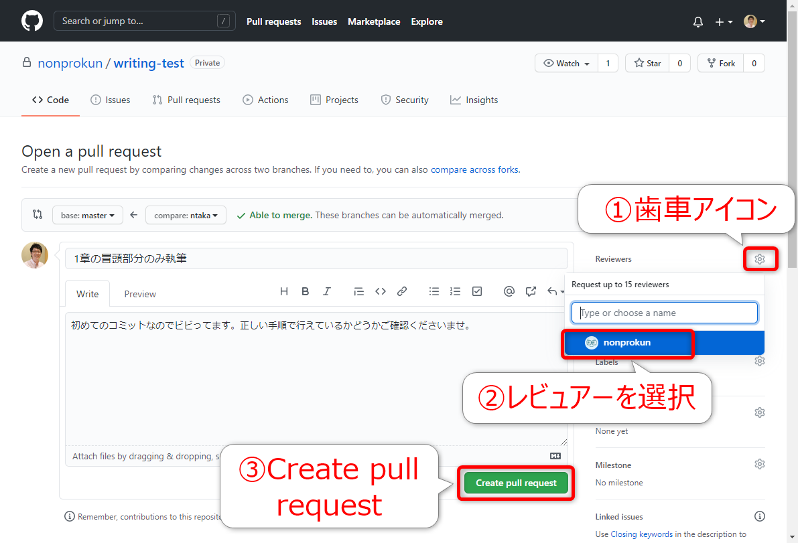
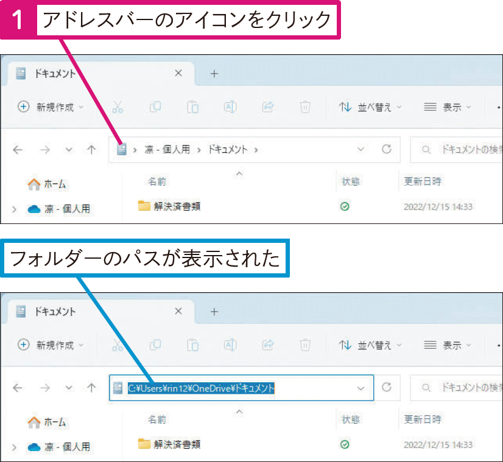

半分AIに作らせて半分自分で書いたら、である調とですます調が混ざってしまった😇
# 普段の開発方法

## 1-1. ブランチを切る

必ずしも毎回やる必要はないが、`main`では開発しない。

### VS Code上でやる場合

左下のボタンを押す


新たにブランチを作る場合は`Create new branch`、すでにあるブランチに移る場合はそのブランチを選択


ブランチの名前を入力してEnter


### コマンドでやる場合
新しいブランチを作るのとそこに移動するので同じコマンド。`new_branch`は適当な名前にする。

```bash
git checkout new_branch
```

## 1-2. `main`ブランチの内容を取得する(オプション)
もし同じブランチを使い続ける場合は、以下のコマンドを実行すると最新の`main`の状態と同期した上で開発できる。

```bash
git merge main
```

## 2. サーバーを起動

```bash
npm run dev
```

その後[http://localhost:3000](http://localhost:3000)を開く

## 3. 開発する

頑張る。Claude Codeなどを活用すると良い。

CSSについて、サイトで学習した記法は`globals.css`などに以下のように記述する方法だった。

```css
.heading {
  color: #cf2b0e;
  font-weight: 500;
  font-size: 2.5rem;
  line-height: 2.5rem;
  font-weight: 700;
  margin-left: auto;
  margin-right: auto;
  margin-top: 2rem;
  margin-bottom: 0.5rem;
}
```

ただ、これは少々冗長なところがあり、かつわざわざCSSファイルに移動する手間が省けるなどのメリットがあるため、**Tailwind CSS**が使われることも多い。これらは別物というわけではなく、Tailwind CSSは裏で勝手にCSSに変換される。

Tailwind CSSは`globals.css`のようなCSSファイルに書くのではなく、HTMLの各要素の`className`に直接書く。

例：
```HTML
<p className="text-4xl md:text-5xl text-center text-red font-bold">Manaka</p>
```

記法はCSSとちょっと違ってくるので初めは慣れないが、AIに〇〇がしたいと聞けば教えてくれるので、たくさんいじってみて徐々に慣れながら覚えていくのが一番早いと思う。

## 4. 確認する

[http://localhost:3000](http://localhost:3000)で自分の思った通りの変更がなされているかを**必ず**確認する。レイアウトが崩れていたり、バグがあるのにコミットしない。それは誤字がある卒論を提出するようなもの。

## 5. コミットする

Gitにファイルの変更内容をセーブすることを**コミット(Commit)する**という。VS Codeに備わっているGUIからやるのが一番楽。

## 6. プルリクエスト(Pull Request, PR, プルリク)を作成する

自分の行った変更を特定のブランチ(今回なら`main`)に取り込むようお願いすることをプルリクエストという。レビュアーがそのコードを見て問題なさそうなら変更を特定のブランチにマージ(merge, 結合)する。

コミットした上で[GitHubのリポジトリ](https://github.com/iGEM-Waseda/podcast-homepage)に移動する。その上で[このサイト](https://zenn.dev/gachigachi/articles/dcd833c56bd0ed)の**2.1.pull requestを作成する**を参考にプルリクエストを作成する。その時、Reviewerとして鳥山(kiha40-777, Minami-Aso-Mizuno-Umarerusato-Hakusui-Kogen)を指定する。  



## 困った時は

DMして

# Getting Started

このプロジェクトは Next.js を使用して開発されています。

## 1. Node.js のインストール

本プロジェクトを実行するには Node.js が必要です。

### Windows / macOS

1. [Node.js公式サイト](https://nodejs.org/ja)から最新版のLTS（推奨版）をダウンロードします。
2. ダウンロードしたインストーラを実行し、画面の指示に従ってインストールします。

インストール後 PowerShell または コマンドプロンプトを開き、以下を実行してください。

```bash
node -v
npm -v
```

バージョン番号が表示されればインストールは完了です。

## 2. リポジトリの取得

PowerShell または コマンドプロンプト上で好きなフォルダに移動し、リポジトリをクローンします。

```bash
cd <directory>
git clone https://github.com/iGEM-Waseda/podcast-homepage.git
cd podcast-homepage
```

`<directory>`にはフォルダのパスを入力してください。


## 3. 依存パッケージのインストール

プロジェクトディレクトリで以下を実行します。

```bash
npm install
```

初回は数分かかる場合があります。

## 4. 開発サーバーの起動

以下のコマンドを実行します。

```bash
npm run dev
```

正常に起動すると、以下のようなメッセージが表示されます。

```text
Local: http://localhost:3000
```

## 5. ブラウザで確認

ブラウザで以下の URL を開いてください。

```text
http://localhost:3000
```

アプリケーションが表示されればセットアップ完了です。

## 開発方法

ページの内容は以下のファイルを編集することで変更できます。

```text
app/page.tsx
```

ファイルを保存すると、ブラウザが自動的に更新されます。

## トラブルシューティング

### `node: command not found`

Node.js がインストールされていないか、PATH が正しく設定されていません。

Node.js を再インストールしてください。

### `npm: command not found`

npm が正しくインストールされていません。

Node.js を再インストールしてください。

### `npm install` でエラーが発生する

Node.js のバージョンが古い可能性があります。

以下でバージョンを確認してください。

```bash
node -v
```

LTS版の利用を推奨します。

## Learn More

* Next.js Documentation: https://nextjs.org/docs
* Learn Next.js: https://nextjs.org/learn
* Next.js GitHub Repository: https://github.com/vercel/next.js

## Deploy

デプロイには Vercel の利用を推奨します。

詳細は以下を参照してください。

https://nextjs.org/docs/app/building-your-application/deploying
